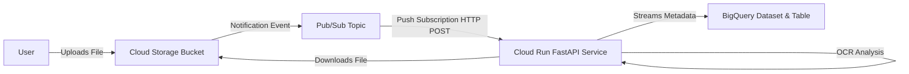

# Serverless Event-Driven Document Processing Pipeline on GCP

This project implements a serverless, event-driven document processing pipeline on Google Cloud Platform (GCP).

## Architecture

1. **Ingestion**: A user uploads a file (e.g., `.txt`, `.pdf`, `.png`) to a Google Cloud Storage (GCS) bucket.
2. **Event Trigger**: The upload automatically triggers a GCS Notification, publishing a message to a Pub/Sub topic.
3. **Execution**: A Pub/Sub Push Subscription forwards the event to a Python service running on Cloud Run.
4. **Processing**: The Cloud Run service (FastAPI) downloads the file from GCS, simulates OCR word extraction and tag generation, and streams the document metadata into a BigQuery table.



---

## Directory Structure

* `src/`
  * [main.py](file:///c:/Users/steve/OneDrive/Desktop/Data%20projects/Kaggle%20AI%20Agents/Day01/AI-Studio-Lab/src/main.py): FastAPI web application with webhook parser, simulated OCR, and BigQuery integration.
  * [requirements.txt](file:///c:/Users/steve/OneDrive/Desktop/Data%20projects/Kaggle%20AI%20Agents/Day01/AI-Studio-Lab/src/requirements.txt): Python dependencies.
  * [Dockerfile](file:///c:/Users/steve/OneDrive/Desktop/Data%20projects/Kaggle%20AI%20Agents/Day01/AI-Studio-Lab/src/Dockerfile): Container configuration for Cloud Run deployment.
* `terraform/`
  * [main.tf](file:///c:/Users/steve/OneDrive/Desktop/Data%20projects/Kaggle%20AI%20Agents/Day01/AI-Studio-Lab/terraform/main.tf): Configuration for all GCP resources (GCS, Pub/Sub, BigQuery, IAM, and Cloud Run).
  * [variables.tf](file:///c:/Users/steve/OneDrive/Desktop/Data%20projects/Kaggle%20AI%20Agents/Day01/AI-Studio-Lab/terraform/variables.tf): Configuration parameters.
  * [outputs.tf](file:///c:/Users/steve/OneDrive/Desktop/Data%20projects/Kaggle%20AI%20Agents/Day01/AI-Studio-Lab/terraform/outputs.tf): Exposes resource details after applying changes.
  * [terraform.tfvars.example](file:///c:/Users/steve/OneDrive/Desktop/Data%20projects/Kaggle%20AI%20Agents/Day01/AI-Studio-Lab/terraform/terraform.tfvars.example): Template for local variable overrides.
* `tests/`
  * [mock_trigger.py](file:///c:/Users/steve/OneDrive/Desktop/Data%20projects/Kaggle%20AI%20Agents/Day01/AI-Studio-Lab/tests/mock_trigger.py): Utility script to mock Pub/Sub events for local development.
* `dashboard/`
  * [app.py](file:///c:/Users/steve/OneDrive/Desktop/Data%20projects/Kaggle%20AI%20Agents/Day01/AI-Studio-Lab/dashboard/app.py): Flask application querying BigQuery metadata.
  * `templates/index.html`: Responsive, single-page metadata display.
  * `static/css/` & `static/js/`: Premium dark theme styling and interactive JS controller.
* `deploy.sh` / `deploy.ps1`: Automated deployment scripts.
* `test_cloud.sh` / `test_cloud.ps1`: Automated pipeline testing and validation scripts.

---

## Local Development & Testing

Follow these steps to run the pipeline service locally using your Google Cloud credentials to talk to actual GCP storage/database resources:

### 1. Authenticate with Google Cloud
Ensure you have the Google Cloud CLI (`gcloud`) installed. Log in and configure your Application Default Credentials (ADC):
```bash
gcloud auth login
gcloud auth application-default login
```
Set your default GCP project:
```bash
gcloud config set project YOUR_GCP_PROJECT_ID
```

### 2. Set Up Python Environment
Create a virtual environment and install dependencies:
```bash
python -m venv venv
# On Windows (PowerShell):
.\venv\Scripts\Activate.ps1
# On macOS/Linux:
source venv/bin/activate

pip install -r src/requirements.txt
```

### 3. Set Environment Variables
Set the environment variables needed by the local app to point to your GCP resources:
```powershell
# PowerShell (Windows)
$env:GCP_PROJECT="YOUR_GCP_PROJECT_ID"
$env:BQ_DATASET="document_processing"
$env:BQ_TABLE="processed_metadata"

# Bash (macOS/Linux)
export GCP_PROJECT="YOUR_GCP_PROJECT_ID"
export BQ_DATASET="document_processing"
export BQ_TABLE="processed_metadata"
```

### 4. Run the FastAPI Web Server
Start the local web server:
```bash
uvicorn src.main:app --host 127.0.0.1 --port 8080 --reload
```

### 5. Send Mock Pub/Sub Triggers
Open a separate terminal window, activate the virtual environment, and use the trigger script to simulate GCS upload events:
```bash
python tests/mock_trigger.py --url http://127.0.0.1:8080/webhook --bucket "YOUR_GCS_BUCKET_NAME" --file "document.txt"
```
*(Make sure the specified file actually exists in your bucket to test the complete flow, or mock GCS calls if you want to bypass cloud requests.)*

---

## Cloud Deployment (Terraform)

### 1. Build and Push Container Image
Cloud Run services deploy containerized apps. Create an Artifact Registry repository and build/push your image:
```bash
# Create artifact registry repository
gcloud artifacts repositories create my-repo --repository-format=docker --location=us-central1

# Configure Docker auth
gcloud auth configure-docker us-central1-docker.pkg.dev

# Build the docker container
docker build -t us-central1-docker.pkg.dev/YOUR_GCP_PROJECT_ID/my-repo/document-processor:latest ./src

# Push to Artifact Registry
docker push us-central1-docker.pkg.dev/YOUR_GCP_PROJECT_ID/my-repo/document-processor:latest
```

### 2. Configure Terraform variables
Copy the example variables file and set the values to match your GCP project:
```bash
cp terraform/terraform.tfvars.example terraform/terraform.tfvars
```
Edit `terraform/terraform.tfvars` with your project ID, globally unique bucket name, and the container image URL.

### 3. Deploy
Navigate to the `terraform/` directory, initialize, and apply:
```bash
cd terraform
terraform init
terraform apply
```
Type `yes` when prompted to verify and provision your infrastructure.

### 4. Verify Live Pipeline
You can verify the entire pipeline (GCS upload -> Pub/Sub notification -> Cloud Run processing -> BigQuery streaming) using the automated validation tools:

* **On PowerShell (Windows)**:
  ```powershell
  .\test_cloud.ps1
  ```
* **On Bash (Linux/macOS/Git Bash)**:
  ```bash
  chmod +x test_cloud.sh
  ./test_cloud.sh
  ```

Alternatively, you can manually upload a file to your GCS bucket:
```bash
gcloud storage cp test_doc.txt gs://YOUR_UNIQUE_BUCKET_NAME/test_doc.txt
```
Then query BigQuery or check the Cloud Run logs in the GCP Console to verify metadata insertion.

---

## Document Processing Dashboard

This project includes a modern, interactive dashboard to browse, search, and filter processed document metadata.

### 1. Set Up Environment
Activate your virtual environment and install dashboard dependencies:
```bash
pip install -r dashboard/requirements.txt
```

### 2. Run the Dashboard
Start the Flask development server:
```bash
python dashboard/app.py
```

### 3. Open in Browser
Open [http://localhost:5000](http://localhost:5000) in your web browser. 

* **Simulation Mode**: If the app cannot connect to BigQuery due to missing local credentials, it will display a notification banner and load a beautiful mock dataset, allowing you to test searching and tag-filtering immediately.

